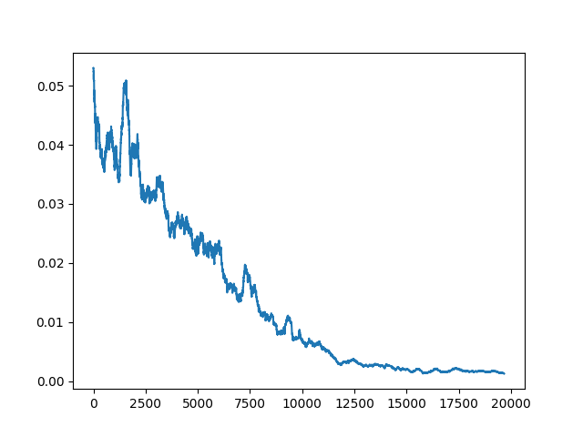
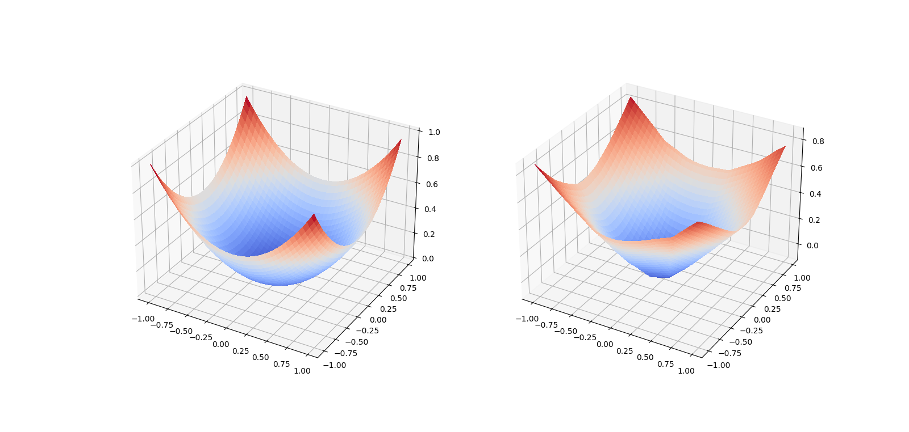

# Example Autograd Implmentation

___


Example implementation of reverse mode automatic differentiation for deep neural networks.




Loss over 20000 training steps of a network aiming to model the 2 dimensional function on the left bellow. The plot on the right is the model output.




## Usage:

```py
from src.model import Model
from src.layer import Layer
from src.functions import Linear, LeakyRelu

layer_dims = [2, 30, 30, 1]
model = Model()
layers = [Layer(d1, d2, activation=LeakyRelu(0.1)) for d1, d2
          in zip(layer_dims[:-1], layer_dims[1:-1])]
last_layer = Layer(layer_dims[-2], layer_dims[-1],
                   activation=Linear())
layers.append(last_layer)
model.add_layers(layers)
model.compile()

X = np.uniform.random(-1, 1, 2)
Y = np.uniform.random(-1, 1, 1)
loss, grads = model.compute_grads(X, Y)
```
